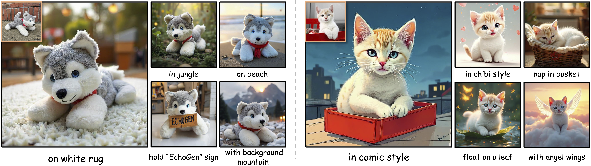

# EchoGen: Generating Visual Echoes in Any Scene via Feed-Forward Subject-Driven Auto-Regressive Model <br><sub></sub>

[](https://arxiv.org/abs/2509.26127)&nbsp; [](https://github.com/drx-code/EchoGen)&nbsp;[](https://huggingface.co/UmiSonoda16/EchoGen)&nbsp;

<p align="center">
  
</p>

This repository provides the official PyTorch/GPU implementation of the paper [EchoGen: Generating Visual Echoes in Any Scene via Feed-Forward Subject-Driven Auto-Regressive Model](https://arxiv.org/abs/2509.26127).

## 🔥 Updates!!
- [x] 2026.4.13: Released the training & inference code.
- [x] 2026.4.13: Released the EchoGen-2B checkpoint.

## ⚡️ Introduction
We propose **EchoGen**, the first **feed-forward subject-driven image synthesis framework built on Visual Auto-Regressive models (VAR)**. EchoGen is capable of generating faithful renditions of a given subject in arbitrary text-described scenes without any test-time optimization. Unlike prior subject-driven approaches, EchoGen leverages the efficiency and hierarchical generation capability of visual autoregressive models to enable subject-driven generation.

Our method introduces:

- **A feed-forward visual autoregressive paradigm for subject-driven generation**, bringing subject control into visual autoregressive modeling and enabling zero-shot synthesis of subjects with significantly lower inference latency.
- **A dual-path subject injection mechanism**, which disentangles subject identity into high-level semantic features and fine-grained visual details, and injects them through decoupled cross-attention or multi-modal attention, respectively, to achieve more faithful and robust subject preservation across diverse scenes.

Evaluated on DreamBench, EchoGen achieves **subject fidelity, text alignment, and image quality comparable to or better than leading diffusion-based methods**, while offering **substantially faster sampling**.


This repo contains:

- 🪐 A clean PyTorch implementation of our [EchoGen model](echogen/models/echogen.py).
- 🛸 Training scripts for [EchoGen](scripts/train.sh), built with PyTorch FSDP.
- 🦄 An inference script for [EchoGen](scripts/infer.sh) to generate high-fidelity subject-driven images with the EchoGen-2B model.


## 🌿 Data Preparation
As in [Infinity](https://github.com/FoundationVision/Infinity), the training dataset should follow the structure below. Specifically, the dataset consists of a set of JSONL files named as `[h_div_w_template]_[num_examples].jsonl`. Where:

- `h_div_w_template` denotes the target aspect-ratio template, defined as the height-to-width ratio of the images.
- `num_examples` denotes the number of training examples whose actual `h / w` values are close to this template ratio.

In other words, each filename should explicitly indicate both the aspect-ratio template and the number of examples associated with it.

```text
/path/to/dataset/:
  [h_div_w_template1]_[num_examples].jsonl
  [h_div_w_template2]_[num_examples].jsonl
  [h_div_w_template3]_[num_examples].jsonl
```

Each `[h_div_w_template]_[num_examples].jsonl` file contains one JSON object per line, and each object should include the following fields:
```json
{
  "output_image": "path/to/the ground-truth image, required",
  "cond_image": "path/to/the conditioning image, required",
  "h_div_w": "float value representing the image aspect ratio, required",
  "long_caption": "long-form text caption of the image, required"
}
```
We also provide a toy dataset as a minimal example in [this directory](data), and you can prepare your own dataset by following the same format.

To keep this repository focused on the core contributions of EchoGen, we do not include the subject-segmentation preprocessing pipeline in this release. You may prepare the conditional image with any off-the-shelf visual-language model (*e.g.*, [Qwen 3.5](https://github.com/QwenLM/Qwen3.5)) and the subject segmentation tool (*e.g.*, [GroundingDINO](https://github.com/idea-research/groundingdino)) following the discussion in the paper.

## 💥 Installation

Clone the repository:
```Bash
git clone https://github.com/drx-code/EchoGen.git
cd EchoGen
```
A suitable [conda](https://conda.io/) environment can be created and activated as follows:
```Bash
conda create -n echogen python=3.10
conda activate echogen
pip install -r requirements.txt
pip install flash_attn --no-build-isolation --no-cache-dir
```

To set up the essential core components in EchoGen, run the provided [build script](scripts/build.sh). This will automatically download the following components:

- [DINO-v2](https://github.com/facebookresearch/dinov2): Semantic image encoder.
- [FLUX.1-dev VAE](https://huggingface.co/black-forest-labs/FLUX.1-dev): Detailed content image encoder.
- [GroundingDINO](https://github.com/IDEA-Research/GroundingDINO): Pre-trained segmentation model for subject segmentation.
- [Infinity](https://huggingface.co/FoundationVision/Infinity): Core pre-trained weights for the generation backbone.

```Bash
sh scripts/build.sh
```

Then, download the pre-trained EchoGen-2B model:
```Bash
sh scripts/download.sh
```
For convenience, the pre-trained EchoGen-2B model can also be downloaded directly here:
- [EchoGen-2B model](https://huggingface.co/UmiSonoda16/EchoGen/resolve/main/echogen_2b.pth?download=true)

## ✨ Model Training 

Training the EchoGen-2B model can be started by running the [script](scripts/train.sh):
```Bash
# train EchoGen-2B model
sh scripts/train.sh
```
To train EchoGen with different model sizes `{125M, 2B}` and different resolutions `{256, 1024}`, you can run the following commands:

```Bash
# 125M, layer12, pixel number = 256 x 256 = 0.06M Pixels
torchrun --nproc_per_node=8 --nnodes=... --node_rank=... --master_addr=... --master_port=... train.py \
  --model=layer12c4 --pn 0.06M --exp_name=infinity_125M_pn_0.06M \
  --content_feats_len=1024 --content_feats_dim=16 --semantic_feats_len=257 --semantic_feats_dim=768 \
  --vae_type 16 --vae_ckpt=pretrained/infinity/infinity_vae_d16.pth --rush_resume=pretrained/infinity/infinity_125M_256x256.pth
# 2B, layer32, pixel number = 256 x 256 = 0.06M Pixels
torchrun --nproc_per_node=8 --nnodes=... --node_rank=... --master_addr=... --master_port=... train.py \
  --model=2bc8 --pn 0.06M --exp_name=infinity_2B_pn_0.06M \
  --content_feats_len=1024 --content_feats_dim=16 --semantic_feats_len=257 --semantic_feats_dim=768 \
  --vae_type 32 --vae_ckpt=pretrained/infinity/infinity_vae_d32reg.pth --rush_resume=pretrained/infinity/infinity_2b_reg.pth
# 2B, layer32, pixel number = 1024 x 1024 = 1M Pixels
torchrun --nproc_per_node=8 --nnodes=... --node_rank=... --master_addr=... --master_port=... train.py \
  --model=2bc8 --pn 1M --exp_name=infinity_2B_pn_1M \
  --content_feats_len=4096 --content_feats_dim=16 --semantic_feats_len=1025 --semantic_feats_dim=768 \
  --vae_type 32 --vae_ckpt=pretrained/infinity/infinity_vae_d32reg.pth --rush_resume=pretrained/infinity/infinity_2b_reg.pth
```
As in [Infinity](https://github.com/FoundationVision/Infinity), a folder named `local_output` will be created to save checkpoints and logs. You can monitor the training process by checking `local_output/log.txt` and `local_output/stdout.txt`, or using [wandb](https://wandb.ai/site/) for more detailed logging.

If your experiment is interrupted, simply re-run the command. Training will automatically resume from the latest checkpoint in `local_output/ckpt*.pth`.

You can also fine-tune the model based on our EchoGen-2B pretrained checkpoints by setting `--rush_resume=[echogen_2b.pth]` in [train.sh](scripts/train.sh). After fine-tuning, you will obtain a checkpoint like `[local_output]/ar-ckpt-giter(xxx)K-ep(xxx)-iter(xxx)-last.pth`.

## ⛅ Inference 
We provide [infer.sh](scripts/infer.sh) for inference.
```Bash
sh scripts/infer.sh
```
For inference with your own control image and text instruction, you can set `--control_img` and `--prompt` accordingly.

To perform inference with our EchoGen-2B model at 1024px resolution, please use the following arguments:
```Bash
pn=1M
model_type=echogen_2b
vae_type=32
vae_path=pretrained/infinity/infinity_vae_d32reg.pth
content_feats_len=4096 
semantic_feats_len=1025 
```

If you want to perform inference with the EchoGen-125M model at 256px resolution, use:
```Bash
pn=0.06M
model_type=echogen_layer12
vae_type=16
vae_path=pretrained/infinity/infinity_vae_d16.pth
content_feats_len=1024 
semantic_feats_len=257 
```

## Acknowledgements
The code in this repository is mainly based on [Infinity](https://github.com/FoundationVision/Infinity).

## License
This repository is licensed under the MIT License. See the [LICENSE](LICENSE) file for details.

## Contact

If you have any questions, please contact us by email: dongruixiaoyx@mail.ustc.edu.cn.

## Citation
If our work contributes to your research, please don't hesitate to give us a star ⭐ and cite us as follows:
```bibtex
@inproceedings{
    dong2026echogen,
    title={EchoGen: Generating Visual Echoes in Any Scene via Feed-Forward Subject-Driven Auto-Regressive Model},
    author={Ruixiao Dong and Zhendong Wang and Keli Liu and Li Li and Ying Chen and Kai Li and Daowen Li and Houqiang Li},
    booktitle={The Fourteenth International Conference on Learning Representations},
    year={2026},
    url={https://openreview.net/forum?id=ctmyCjo18u}
}
```